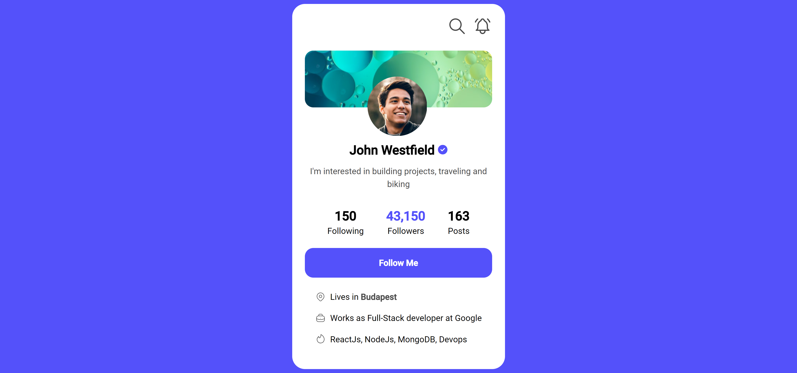

# Web Development Mentor - Profile Widget Solution

This is a solution to the [Profile Widget Solution on Web Development Mentor](https://webdevelopermentor.com/challenges/profile-widget).

## Table of contents

- [Web Development Mentor - Profile Widget Solution](#web-development-mentor---profile-widget-solution)
  - [Table of contents](#table-of-contents)
    - [Screenshot](#screenshot)
    - [Links](#links)
  - [My process](#my-process)
    - [Built with](#built-with)

### Screenshot

### Links

- Solution URL: [https://github.com/ShrutiShinde418/WebDevelopmentMentor/tree/main/profile-widget](https://github.com/ShrutiShinde418/WebDevelopmentMentor/tree/main/profile-widget)
- Live Site URL: [https://profile-widget-dp0d2okzb-shrutishinde418.vercel.app/](https://profile-widget-dp0d2okzb-shrutishinde418.vercel.app/)

## My process

### Built with

- Tailwind CSS

